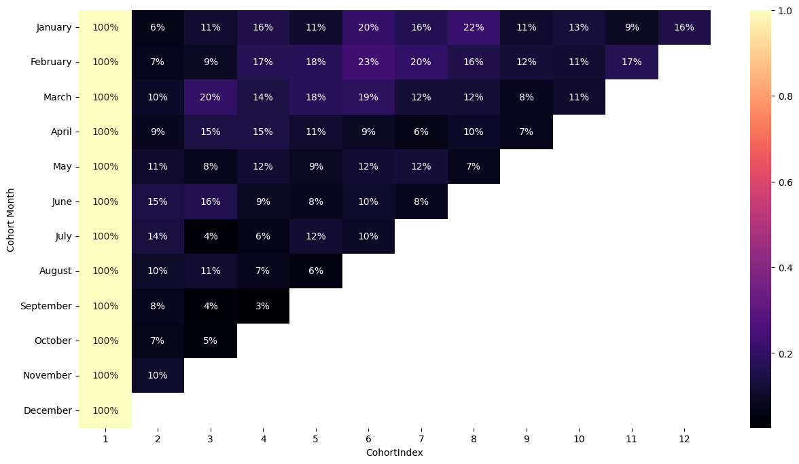
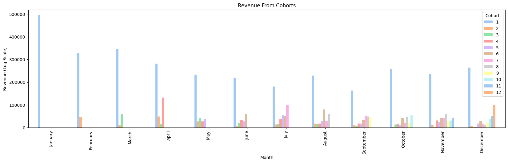
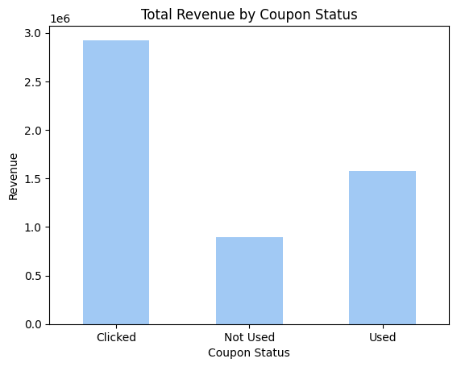
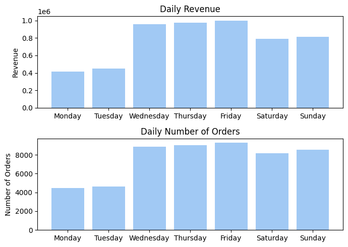

# Introduccion:
En este proyecto de Python, llevamos a cabo un análisis detallado de un conjunto de datos que abarca diversas columnas de valores financieros. El conjunto de datos comprende información relacionada con los movimientos de compras de un E-Commerce. Nuestro objetivo principal consiste en extraer ideas clave sobre las tendencias y patrones presentes en estos registros financieros. A través de la visualización y resumen de los datos, buscamos comprender la evolución del comportamiento de los ingresos a lo largo del tiempo y analizar la distribución de estos . Este análisis nos proporcionará información valiosa acerca de las tendencias financieras, lo cual resultará fundamental para la toma de decisiones basada en datos.

# Datos

El dataset con el que se trabajara consta de siguientes 4 archivos:

**Online_Sales.csv:** This file contains actual orders data (point of Sales data) at transaction level with
below variables.

- *CustomerID:* Customer unique ID
- *Transaction_ID:* Transaction Unique ID
- *Transaction_Date:* Date of Transaction
- *Product_SKU:* SKU ID – Unique Id for product
- *Product_Description:* Product Description
- *Product_Cateogry:* Product Category
- *Quantity:* Number of items ordered
- *Avg_Price:* Price per one quantity
- *Delivery_Charges:* Charges for delivery
- *Coupon_Status:* Any discount coupon applied

**Customers_Data.csv:** This file contains customer’s demographics.

- *CustomerID:* Customer Unique ID
- *Gender:* Gender of customer
- *Location:* Location of Customer
- *Tenure_Months:* Tenure in Months

**Discount_Coupon.csv**: Discount coupons have been given for different categories in different months

- *Month*: Discount coupon applied in that month
- *Product_Category*: Product category
- *Coupon_Code:* Coupon Code for given Category and given month
- *Discount_pct:* Discount Percentage for given coupon

**Marketing_Spend.csv:** Marketing spend on both offline & online channels on day wise.

- *Date*: Date
- *Offline_Spend:* Marketing spend on offline channels like TV, Radio, NewsPapers, Hordings etc…
- *Online_Spend:* Marketing spend on online channels like Google keywords, facebook etc..

**Tax_Amount.csv**: GST Details for given category

- *Product_Category:* Product Category
- *GST:* Percentage of GST

# Business Objective:
La compañia de E-Commerce espera cumplir con los siguientes requisitos

> ## Calculate Invoice amount or sale_amount or revenue for each transaction and item level
> - Invoice Value =(( QuantityAvg_price)(1-Dicount_pct)*(1+GST))+Delivery_Charges
>
> ## Perform Detailed exploratory analysis
> - Understanding how many customers acquired every month
>- Understand the retention of customers on month on month basis
>- How the revenues from existing/new customers on month on month basis
>- How the discounts playing role in the revenues?
>- Understand the trends/seasonality of sales by category, location, month etc…
>- How number order varies and sales with different days?
>- How marketing spend is impacting on revenue?
>- Which product was appeared in the transactions?
>- Which product was purchased mostly based on the quantity?
>
>## Performing Customer Segmentation
>- Heuristic (Value based, RFM) – Divide the customers into Premium, Gold, Silver, Standard customers and define strategy on the same.
>- Scientific (Using K-Means) & Understand the profiles. Define strategy for each segment.
>
>## Predicting Customer Lifetime Value (Low Value/Medium Value/High Value)
>- Define a dependent variable with categories low value, medium value, high value using customer revenue Then perform a Classification model.

# EDA Preliminar:

### CustomerData

En este gráfico, observamos la distribución general de nuestros clientes según su género y localidad. También se aprecia una agrupación de clientes en función de su antigüedad (tenure).

### Marketing_Spends

El primer gráfico presenta los gastos diarios realizados en marketing, abarcando tanto el ámbito offline como el digital.

En el segundo gráfico, estos gastos se encuentran agrupados mensualmente, incorporando además una tercera línea que representa el total de gastos.

### Online_Sales

En estos gráficos, se pueden identificar los usuarios que realizaron el mayor número de transacciones, tanto en términos de cantidad de compras como de montos invertidos. Además, se presenta una distribución general que refleja las tendencias por temporada y destaca los productos más comercializados, así como aquellos que generan mayores ganancias.

---

# Cumpliendo los objetivos de negocio

- ### Understanding how many customers acquired every month

Para este objetivo se realizo un histograma agrupando los clientes por su primer compra en el año. Notamos como varios de ellos realizan su primer compra entre Junio y Agosto, siendo este ultimo el pico

- ### Understand the retention of customers on month on month basis

Para cumplir este objetivo se realizo un agrupamiento de clientes por cohortes mensuales. 

Se hace evidente la estacionalidad del conjunto. 
La Cohorte de Marzo parece tener tasas de retención relativamente altas en los primeros meses. Especialmente, la retención en el tercer mes es significativamente alta (20%).

- ### How the revenues from existing/new customers on month on month basis

### Diferenciacion por cohortes

### Diferenciacion por numero de compras

### Diferenciacion por tiempo como cliente

Se categorizó a los clientes en "nuevo clientes" y "clientes existentes" que tenemos clientes que llevan hasta 50 meses comprando, para categorizar los clientes entre "nuevo clientes" y "clientes ya existentes" se utilizo el threshold de 18 meses. 

### How the discounts playing role in the revenues?

### Understand the trends/seasonality of sales by category, location, month etc…
- ### Tendencias por Localidad

- ### Tendencias por Categoria

### How number order varies and sales with different days?

### How marketing spend is impacting on revenue?

### Which product was appeared the most in the transactions?

### Which product was purchased mostly based on the quantity?

<table border="1" class="dataframe">
  <thead>
    <tr style="text-align: right;">
      <th></th>
      <th>Product ID</th>
      <th>Product Description</th>
      <th>Product Category</th>
      <th>Quantity</th>
      <th>Revenue</th>
    </tr>
  </thead>
  <tbody>
    <tr>
      <th>0</th>
      <td>GGOEGBMJ013399</td>
      <td>Sport Bag</td>
      <td>Bags</td>
      <td>7321</td>
      <td>42068.25962</td>
    </tr>
    <tr>
      <th>1</th>
      <td>GGOEGDHC018299</td>
      <td>Google 22 oz Water Bottle</td>
      <td>Drinkware</td>
      <td>9728</td>
      <td>37418.94532</td>
    </tr>
    <tr>
      <th>2</th>
      <td>GGOEGFKQ020399</td>
      <td>Google Laptop and Cell Phone Stickers</td>
      <td>Office</td>
      <td>5847</td>
      <td>24533.63450</td>
    </tr>
    <tr>
      <th>3</th>
      <td>GGOEGFSR022099</td>
      <td>Google Kick Ball</td>
      <td>Lifestyle</td>
      <td>5549</td>
      <td>15676.89884</td>
    </tr>
    <tr>
      <th>4</th>
      <td>GGOEGFYQ016599</td>
      <td>Foam Can and Bottle Cooler</td>
      <td>Drinkware</td>
      <td>5098</td>
      <td>11559.08054</td>
    </tr>
    <tr>
      <th>5</th>
      <td>GGOEGGOA017399</td>
      <td>Maze Pen</td>
      <td>Office</td>
      <td>16234</td>
      <td>19786.07210</td>
    </tr>
    <tr>
      <th>6</th>
      <td>GGOEGOAQ012899</td>
      <td>Ballpoint LED Light Pen</td>
      <td>Office</td>
      <td>4861</td>
      <td>15697.98510</td>
    </tr>
    <tr>
      <th>7</th>
      <td>GGOEGOLC014299</td>
      <td>Google Metallic Notebook Set</td>
      <td>Office</td>
      <td>6496</td>
      <td>41481.37750</td>
    </tr>
    <tr>
      <th>8</th>
      <td>GGOENEBJ079499</td>
      <td>Nest Learning Thermostat 3rd Gen-USA - Stainle...</td>
      <td>Nest-USA</td>
      <td>4570</td>
      <td>731870.69120</td>
    </tr>
    <tr>
      <th>9</th>
      <td>GGOENEBQ078999</td>
      <td>Nest Cam Outdoor Security Camera - USA</td>
      <td>Nest-USA</td>
      <td>5206</td>
      <td>671620.06650</td>
    </tr>
  </tbody>
</table>

# Performing Customer Segmentation

