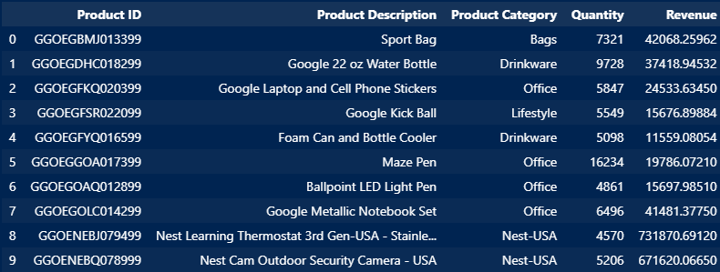

 # Entendiendo cuando nuevos clientes adquirimos por mes

Con el propósito de cumplir con este objetivo, se confeccionó un histograma agrupando a los clientes según su primera compra en el año. Es relevante señalar que un número considerable de clientes realiza su primera compra entre los meses de junio y agosto, siendo agosto el mes que sobresale con el pico más alto.

Este análisis proporciona una visión clara de la distribución de las adquisiciones de clientes a lo largo del año, destacando la concentración de nuevas compras durante el período de junio a agosto. La identificación de estos picos puede servir como base para estrategias de marketing y gestión de inventario, aprovechando la temporada alta de adquisiciones para maximizar el impacto de las iniciativas comerciales.

 # Entendiendo la retencion de clientes mes a mes

Para alcanzar este objetivo, se procedió a agrupar a los clientes en cohortes mensuales. La estacionalidad del conjunto se manifiesta claramente. La cohorte correspondiente al mes de marzo exhibe tasas de retención relativamente elevadas en los primeros meses, destacándose especialmente una retención notoriamente alta en el tercer mes, la cual alcanza el 20%.

Estos hallazgos indican una sólida retención de clientes dentro de la cohorte de marzo durante los primeros meses desde su adquisición. Este análisis mensual de cohortes ofrece una visión detallada de cómo los clientes se mantienen comprometidos con la marca con el paso del tiempo, permitiendo identificar patrones y áreas de mejora en la retención a lo largo de su ciclo de vida.

 # Como son las ganancias de nuevos/antiguos clientes en forma mensual?

### Diferenciación por cohortes

En este gráfico, observamos la distribución de nuestros ingresos en las diferentes cohortes. Una cohorte que merece especial atención es la de agosto, donde el número de ingresos se mantiene relativamente estable durante varios meses. Esto sugiere una estabilidad notoria en el rendimiento financiero de los clientes que se unieron en ese período, evidenciando un impacto sostenido en los ingresos a lo largo del tiempo. La consistencia en los ingresos de esta cohorte podría ofrecer insights valiosos sobre patrones de comportamiento y lealtad del cliente a lo largo de su ciclo de vida.

# Diferenciación por Número de Compras

# Diferenciación por Tiempo como Cliente

Los clientes fueron clasificados como "nuevos clientes" y "clientes existentes", incluyendo a algunos con un historial de compras que abarca hasta 50 meses. Para determinar la categorización como "nuevos" o "existentes", se aplicó un umbral de 18 meses. Esta segmentación posibilita un análisis exhaustivo de las tendencias de ingresos a lo largo del tiempo, considerando la lealtad del cliente y la frecuencia de compras.

Esta distinción entre nuevos y existentes clientes ofrece una visión estratégica de cómo evolucionan los ingresos en diferentes segmentos de la base de clientes. Permite identificar patrones de comportamiento, evaluar la efectividad de las estrategias de retención y diseñar enfoques específicos para nutrir y retener a los clientes existentes, al mismo tiempo que se atraen nuevos clientes. La selección del umbral de 18 meses ofrece un marco temporal significativo para comprender la fidelidad del cliente y su impacto en los resultados financieros.

# Que rol cumplen los descuentos?

Observamos que los descuentos tienen un impacto significativo en las compras, ya que la gran mayoría de los clientes intenta acceder a ellos. Un dato relevante es que aproximadamente el 60% de los clientes hizo clic en la opción de aplicar descuento pero no finalizó la transacción. Es crucial analizar más a fondo el motivo detrás de este comportamiento.

Este fenómeno sugiere un interés activo por parte de los clientes en obtener descuentos, pero la falta de conversión podría estar relacionada con diversos factores, como la percepción del descuento ofrecido, la complejidad del proceso de aplicación, o posiblemente barreras en la experiencia de compra. Un análisis más profundo de la interacción de los clientes con la opción de descuento podría revelar oportunidades para optimizar la conversión y mejorar la satisfacción del cliente

# Entendiendo las tendencias mensuales por categoria y localidad.
- ### Tendencias por Localidad

En estos gráficos, observamos la evolución de las ventas por localidad. En primer lugar, destaca el pico casi homogéneo entre todas las localidades en el mes de agosto. Sin embargo, también identificamos varias tendencias en otros meses que no siguen la misma distribución. En el mes de mayo, cuando todas las demás localidades experimentan un aumento en sus ventas, Washington DC experimenta una disminución. Asimismo, algo similar ocurre en Nueva York al final del año.

Estas variaciones en las tendencias de ventas por localidad señalan la importancia de analizar factores específicos de cada región que puedan influir en el comportamiento de compra. El fenómeno de caída en Washington DC en mayo y en Nueva York al final del año podría ser resultado de eventos locales, estacionales o campañas de marketing específicas. Un análisis más profundo de estos picos y valles proporcionaría información valiosa para ajustar estrategias comerciales y adaptarse a las particularidades de cada mercado.
- ### Tendencias por Categoria

En este gráfico, observamos las tendencias por categoría de productos que tenemos. Es importante destacar que las cantidades se encuentran escaladas.

La visualización de las tendencias por categoría de producto proporciona una comprensión clave de cómo se desempeñan diferentes segmentos en términos de ventas o cualquier otra métrica relevante. La escala de las cantidades garantiza una comparación equitativa entre las categorías, permitiendo identificar patrones y áreas de enfoque. Analizar estas tendencias es fundamental para la toma de decisiones estratégicas, como la asignación de recursos, el lanzamiento de nuevas líneas de productos o la optimización de inventario.

# Como varia el numero de ordenes y de ganancias durante la semana?

En estos gráficos, observamos la distribución de ganancias y de órdenes de forma diaria. Ambas siguen la misma distribución, con un aumento escalonado desde los miércoles y manteniéndose hasta los viernes.

Esta tendencia común entre las ganancias y las órdenes revela un patrón consistente a lo largo de la semana laboral, con picos notables hacia mediados y finales de la semana. Identificar esta sincronización entre los ingresos y las órdenes diarias puede proporcionar valiosos conocimientos operativos y estratégicos. Por ejemplo, podría indicar la necesidad de ajustar recursos o estrategias de marketing para aprovechar al máximo estos períodos de mayor actividad durante la semana y potenciar los primeros dias de la semana. Este análisis detallado de la distribución diaria contribuye a una gestión más efectiva y una mayor comprensión de los patrones de comportamiento del cliente.

# Como afentan los gastos de marketing en las ganancias?

En el gráfico superior, observamos la distinción entre ganancias y gastos de marketing, notando una diferencia significativa entre ambos. Esta disparidad se complementa con el gráfico inferior, donde los montos están escalados, y observamos que siguen prácticamente la misma distribución. Esto indica una correlación alta entre los ingresos y los gastos en marketing, sugiriendo que los gastos en marketing generan efectos positivos.

La consistencia en la distribución similar de ganancias y gastos en marketing respalda la noción de que la inversión en marketing está correlacionada con el rendimiento financiero. Este análisis subraya la importancia de las estrategias de marketing efectivas para impulsar las ganancias y respalda la idea de que los recursos asignados a marketing están contribuyendo de manera positiva al crecimiento y la rentabilidad del negocio. Evaluar esta relación a lo largo del tiempo puede ofrecer insights clave para optimizar futuras inversiones en marketing.

# Que producto aparece en mas transacciones?

En el siguiente gráfico, se muestra cuáles son los productos más comprados en una misma transacción. Observamos algo curioso: varios de estos productos tienen como público objetivo principal al segmento femenino. Esta coincidencia es consistente con la base de datos que tenemos, donde aproximadamente el 65% de nuestro mercado es femenino.

Este hallazgo resalta la importancia de comprender y adaptarse a las preferencias del público objetivo. La correlación entre los productos más comprados juntos y el predominio del público femenino sugiere oportunidades estratégicas para personalizar ofertas, crear paquetes promocionales específicos y mejorar la experiencia de compra para este segmento. Un análisis más detenido de estas asociaciones puede conducir a estrategias de marketing más efectivas y a la optimización del catálogo de productos para satisfacer las necesidades y preferencias de la mayoría de los clientes.

# Que producto fue mas comprado medido en el total de la cantidad?

